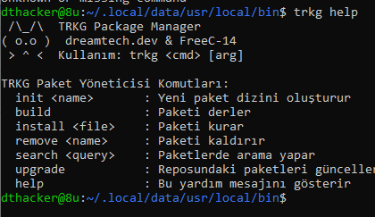
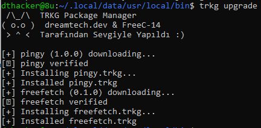
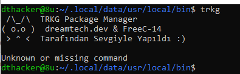

Made by dreamtech.dev, Tutorial Coming Soon.

# GEREKLİ PİP PAKETLERİ:
typer
urllib.request
json
subprocess
typer
hashlib

# TEST EDİLEN PLATFORMLAR:
WSL 1
Ubuntu 22.0
Termux (Kısıtlı, Teorik Olarak Mümkün)

# SCREENSHOTS:

